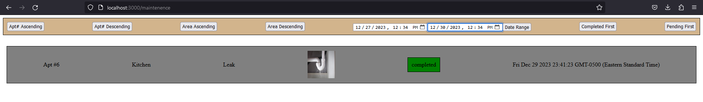
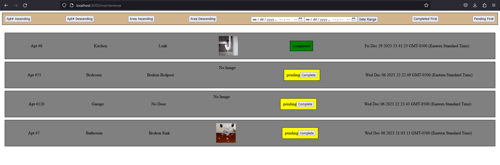

# ApartmentSystem
CMPSC487W Project 3

in React.js, Next.js, TypeScript

# FR1

Tenant "Login" Page

Dynamic Routing, if no tenant with entered ID, show this

Initial Tenant Page, shows prior requests associated with your ID (regardless of Apt#, if you were to change), and form

After adding a request

DB with generated data (ID/Apt from dynamic routing, timestamp)

# FR2

Maintenence Staff page with various filter states

Ascending Apt#

Descending Apt#

Ascending Area Alphabetical

Descending Area Alphabetical

Date Range, none in range

Date Range, one in range

Date Range, three in range

Date Range, all in range

Completed first (Status ascending)

Pending first (Status descending)

# FR3

Initial Pending Request

Marked Completed Request

# FR4

Initial Manager Tenant List & Form view

Initial database of tenants

After adding a tenant

DB after adding a tenant

Switching a tenant's apartment

Deleting a tenant

